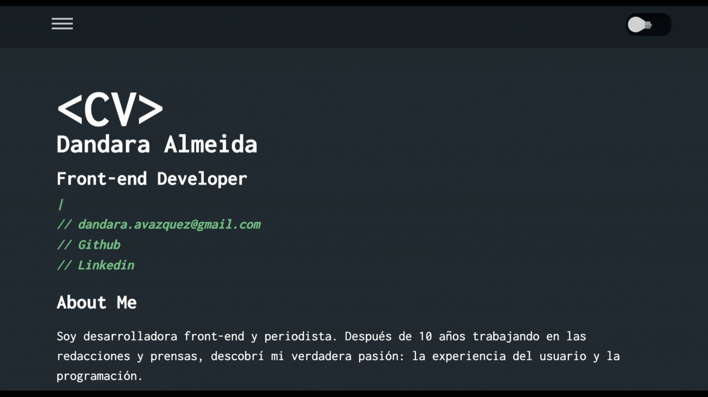

# Este es mi curriculum online

He utilizado React como linguaje de programación y Sass como pre procesador de CSS. 

La página está maquetada con CSS Grid para ordenar cada seccion de la pagina. Además, sigue los parámetros de `mobile first` y de `web responsive`. 

## Contiene:
1) Un menu desplegable que hace scroll a los contenidos de la propria pagina y la opcion de descargar mi curriculum en formato PDF. 
2) Un botón para cambiar entre los modos dark / ligth. 
3) Uso el efecto de typing en la description de mis contactos. 

## Contexto:
He eligido un curriculo online a un portfolio porque me gustaría desarrollar más proyectos antes de presentar un portfolio 

## Dificultades:
Tenia una idea inicial de hacer la pagina tal cual un editor de codigo y para ello intenté agregar un listado de números de las lineas en la lateral izquierda del contenido. 

He conseguido hacer el lista con JavaScript/React, pero tenia problemas con las media queries. Cuando la pantalla se hacia más grande, sobraban números en el listado. Intenté usar "overflow: hidden" para esconder los numeros que sobraban, pero al final no me quedó bien. Así que he desistido de implementar el listado.

Alguien saberia decir como podria hacerlo?
